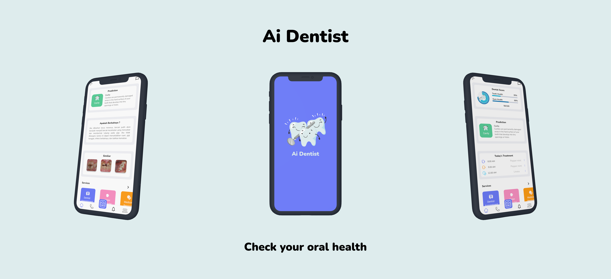

<h1 align="center">
  Project Capstone Bangkit 2022 : AiDentist
</h1>

  
  
  
  

  

## Table of Contents
- [Team Member](#team-member)
- [Introduction](#introduction)
- [Installation](#installation)
- [Demo](#demo)
- [Features](#features)

## Team Member
 
(ML) M2120J1528 - [ Andre Citro Febriliyan Lanyak](https://github.com/andretkj1) - Institut Teknologi Telkom Purwokerto 
(ML) M2120F1522 - Muhammad Rahaji Jhaerol - Institut Teknologi Telkom Purwokerto  
 
(MD) A2120F1521 - [Filfimo Yulfiz Ahsanul Hulqi](https://github.com/4ahsanul) - Institut Teknologi Telkom Purwokerto  
(MD) A2272J2365 - [A.Aksa Nur Irwan](https://github.com/aaksa) - Universitas Muslim Indonesia  
 
(CC) C2272J2366 - A. Muh. Fitrah Asfar  - Universitas Muslim Indonesia 
(CC) C2135J1624 - Muhammad Zulfikar Novaly Rahman  - Politeknik Negeri Ujung Pandang 

## Introduction
**SOON**

## Installation
**SOON**

## Demo
**SOON**

## Features
**SOON**
